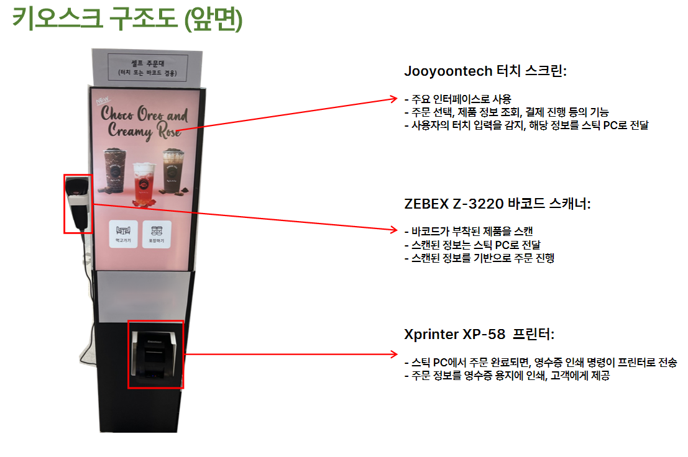
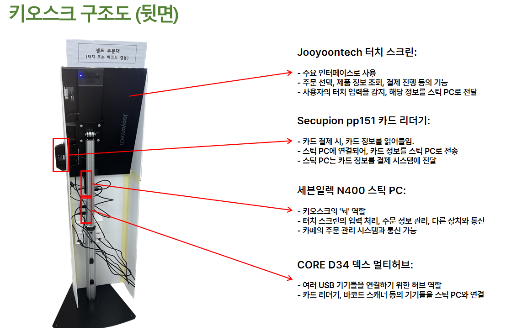

# 코키티 키오스크 프로젝트

자, 이 페이지를 보시는 분은 대개적으로 제 취업을 결정하실 수도 있을 분이실 겁니다.
하지만, 이러한 페이지는 모든 사람이 볼 수 있기에, 어디서 무슨 사람들과 프로젝트를 진행했는 지는 공개하기가 어렵습니다.

## 1. 프로젝트 소개

뭐, 제안요청서와 제안서에는 뭐 미국 기업이 한국 진출 어쩌구 거창하지만, 실제로는 그렇지 않다는 거 짐작은 하실겁니다. 네, 그냥 ███████에서 프로젝트 하라고 시켜서 한 겁니다.
하지만, 프로젝트 산출물 자체는 결제 기능을 제외하고는 거의 완성도가 높습니다. (결제 기능은 결제 모듈을 사용하지 않았기에 실제로 사용할 수 없습니다.)

## 2. 프로젝트 참여자

- ███(본인) : 키오스크 코드 작성
- ███ : 키오스크 화면 디자인
- ███ 교수 : 프로젝트 지도

## 3. 프로젝트 개요

이 프로젝트를 진행하면서 다음과 같은 기술들이 사용되었습니다.

- React
- Yarn

# 4. 프로젝트 시연 영상

<a href="http://www.youtube.com/watch?feature=player_embedded&v=enydetNoStk" target="_blank">
 
</a><br/>
원래는 키오스크에 부착된 장비를 사용하는 시연영상이 있었으나, 개인정보 보호를 위해 삭제했습니다.

# 5. 프로젝트 사용 장비

<br/>
<br/>
키오스크 앞면의 터치스크린 아래 흰색 종이에는 원래 어디서 만들었는 지가 적혀있었지만, 개인정보 보호를 위해 지웠습니다.

# 6. 프로젝트 빌드 방법

1. 먼저, <a href="nodejs.org">Node.js</a>와 <a href="https://classic.yarnpkg.com/en/docs/install#windows-stable">Yarn</a>이 설치되어 있어야 합니다.
2. 윈도우 기준으로 아래의 명령어를 를 실행하여 PowerShell에서 스크립트 실행 권한을 허용해야 합니다.

   ```bash
   Set-ExecutionPolicy RemoteSigned
   ```

3. 프로젝트 파일에서 터미널을 연 후 아래 명령어를 입력하여 필요한 패키지들을 설치합니다.
   ```bash
   yarn
   ```
4. 리액트가 사용되었기에 아래 명령어를 입력하여 리액트를 설치합니다.

   ```bash
   yarn add global react-scripts
   ```

5. 이제 아래의 명령어를 입력하여 리액트를 실행합니다.

   ```bash
   yarn start
   ```

# 7. 저작권

리액트 등 이 프로젝트에 사용된 대다수 패키지들은 MIT 라이센스를 따르기에, 이 프로젝트 역시 MIT 라이센스를 따릅니다.
하지만, 음료 이미지들과 코키티 이미지들은 코키티 본사의 허가 하에 사용되었습니다.

# 8. 여담

원래 이 프로젝트는 키오스크에 한정된 게 아닌 웹사이트도 같이 있었으나, 팀원이 6명이고 실력과 개발 스타일이 제각각이고, 코드 자체도 너무 스파게티 코드가 되어있었기에, 키오스크만 공개합니다. 웹사이트 쪽은 다른 팀원이 알아서 공개할 수도 있습니다. ~~코드 취합할 때 CSS를 괴상하게 집어넣는 사람 때문에 고생~~

# 9. 문서 누락

제안요청서, 제안서, 계획서가 누락되어 있는 것은 저도 잘 압니다. 리브레오피스의 H2O restart를 쓴다 해도 원본과 동일하지 않은지라.. 검열 및 수정을 거치느니 차라리 공개하지 않는 것을 선택했습니다. 솔직히.. 볼 것도 없습니다. 
